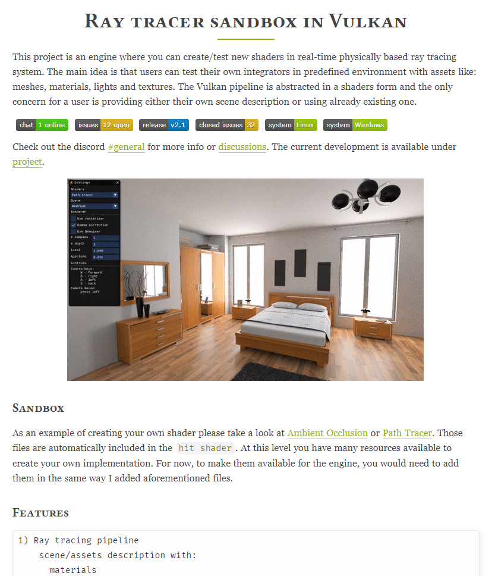
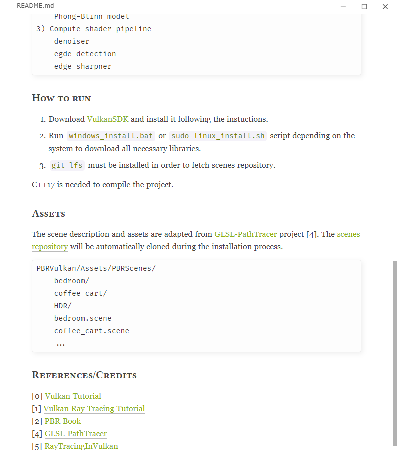
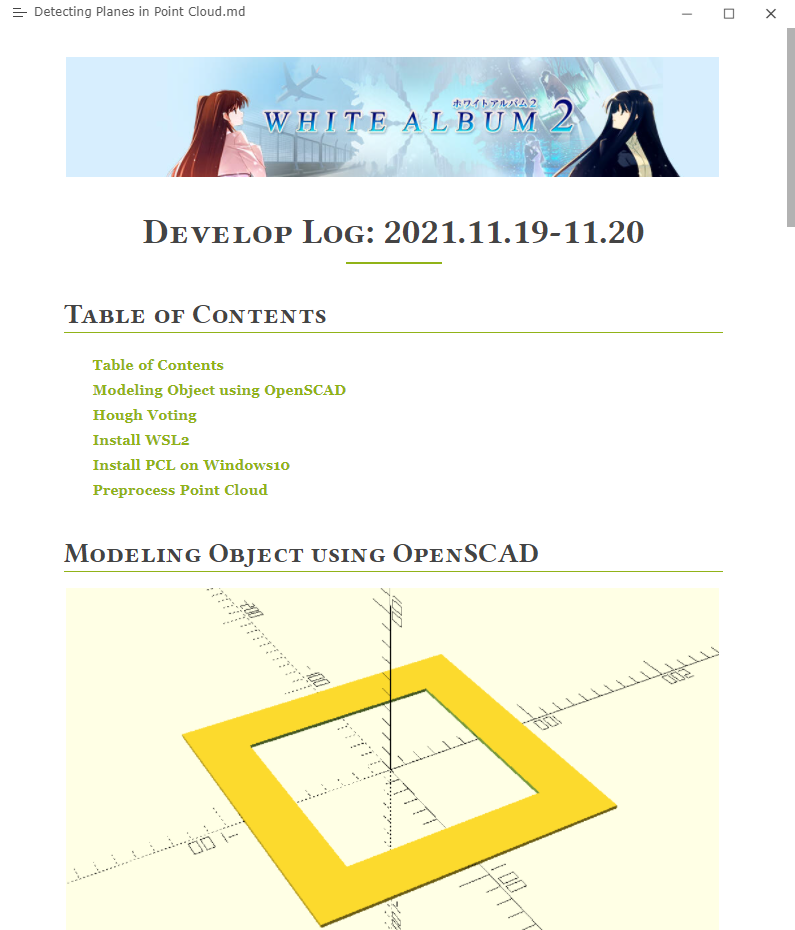

# typora-feng

A custom typora theme for writing academic manuscript/weekly report.

**This theme mainly adopts code from [typora-purple-theme](https://github.com/hliu202/typora-purple-theme) so all credit goes to them.**

## Install

1. Clone or download the project.
2. Copy theme files (file`typora-feng.css` and directory`typora-feng-fonts`) into typora themes folder.
3. Reopen typora and select this theme.

## Preview

